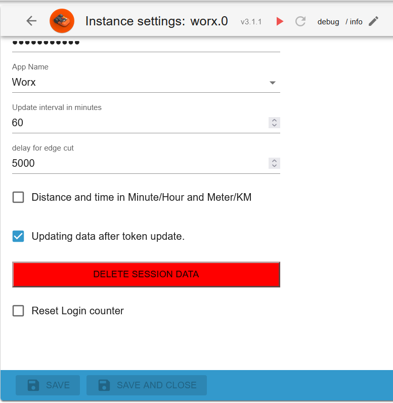
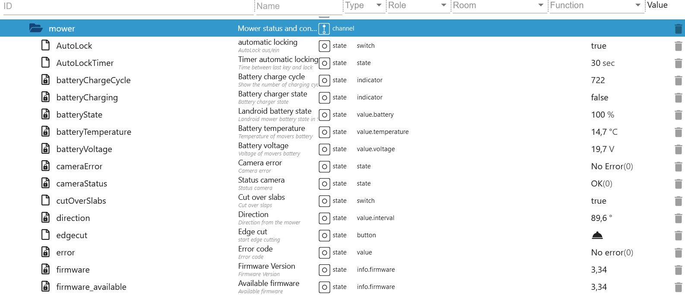
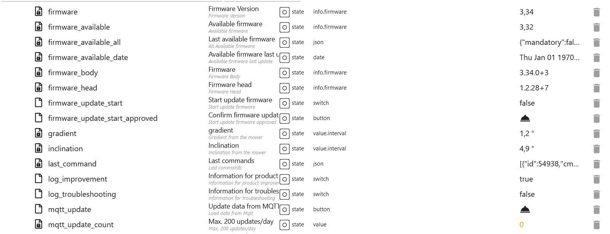
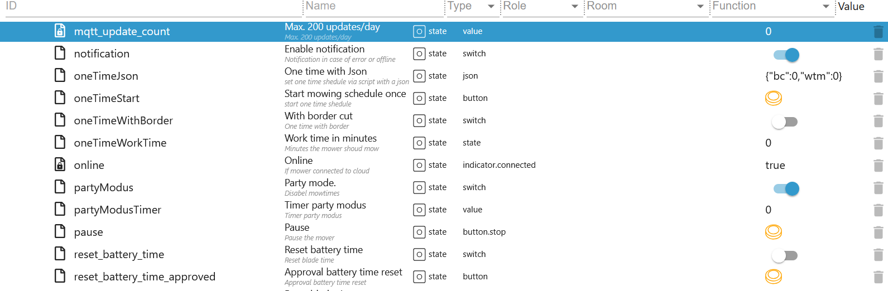
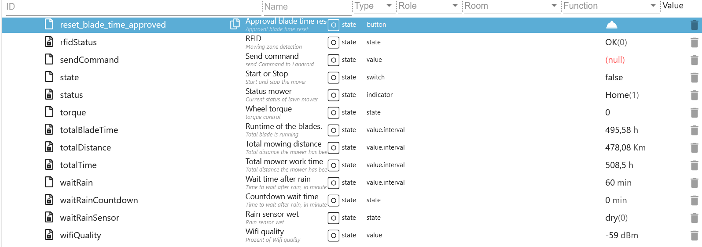
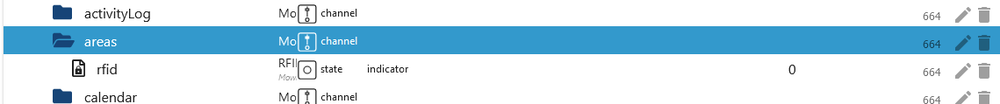

# ioBroker.worx Adapter

## Description

### Instance settings

-   `App Email`: Your APP Username
-   `App Password`: Your APP Password
-   `App Name`: Choose your device
-   `Delay for EdgeCut`: When should EdgeCut start (example 5 seconds to lawn)



-   `Distance and time in min and m`: Default h and km
-   `Ping MQTT Connection every 10 minutes.`: Just to test. Please no longer than 1 hour!


### Folder

-   `activityLog`: Your activity log (control possible)
-   `areas`: Areas (control possible)
-   `calendar`: Time schedule (control possible)
-   `Modules`: Your module(s) (control possible)
-   `mower`: Your mower (control possible)
-   `product`: All properties of your devices (readonly)
-   `rawMqtt`: All data from the cloud (readonly)


### activityLog (Wire and Vision)

-   `last_update`: Last update as timestamp
-   `manuell_update`: Loads the current activity log
-   `payload`: Activity log as JSON Table (for VIS or Blockly)


### areas (without Vision)

-   `actualArea`: Current
-   `actualAreaIndicator`: Next array zone start
-   `area_0`: Start of zone 1 in meters (changeable)
-   `area_1`: Start of zone 2 in meters (changeable)
-   `area_2`: Start of zone 3 in meters (changeable)
-   `area_3`: Start of zone 4 in meters (changeable)
-   `startSequence`: Array zone start (0-9 events) e.g. Start in Zone 2 only [2,2,2,2,2,2,2,2,2,2] (changeable)
-   `zoneKeeper`: Safe driving in narrow zone crossings (as of Firmware 3.30) (changeable)


### calendar (Wire and Vision)

-   E.g. time setting for wednesday

    -   `wednesday.borderCut`: With or without bordercut (Change value without delay)
    -   `wednesday.startTime`: Starttime hh:mm (0-23/0-59) e.g. 09:00 (Change value without delay)
    -   `wednesday.workTime`: Working time in minutes (180 min = 3h) e.g. 30 (Change value without delay)
    -   `calJson_sendto`: If all datapoints are set, then press button to send (with a 1,1 second delay). The mower will now mow for 30 minutes
    -   `calJson_tosend`: This data is sent to Mqtt (Both mowing schedule/is set automatically). You can also create this JSON yourself.
    -   `calendar.calJson`: Mowing schedule weekday name w/o number (mowing schedule 1/is set automatically - for wire only)
    -   `calendar.calJson2`: Mowing schedule weekday name with number (mowing schedule 2/is set automatically - for wire only)


### modules (Wire and Vision)

-   Off Limit Module (Wire and Vision)

    -   `DF.OLMSwitch_Cutting`: Forbidden Zones true-on/false-off
    -   `DF.OLMSwitch_FastHoming`: Fast return to the charging station true-on/false-off

-   ACS Module (Wire only)
    -   `US.ACS`: 1-on/0-off


### mower (Wire and Vision)

-   `AutoLock`: Auto lock true-on/false-off (wire & Vision/changeable)
-   `AutoLockTimer`: Timer auto lock max. 10 minutes in 30 second steps (wire & Vision/changeable)
-   `batteryChargeCycle`: Battery charge cycle (wire & Vision/readonly)
-   `batteryCharging`: Battery charging false->no/true->yes (wire & Vision/readonly)
-   `batteryState`: Battery state in % (wire & Vision/readonly)
-   `batteryTemperature`: Battery temperature in celsius (wire & Vision/readonly)
-   `batteryVoltage`: Battery voltage in Volt (wire & Vision/readonly)
-   `direction`: Direction in grad (wire & Vision/readonly)
-   `edgecut`: Start EdgeCut (wire & Vision/changeable)
-   `error`: Error message from mower (wire & Vision/readonly)

```json
{
    "states": {
        "0": "No error", //(wire & Vision)
        "1": "Trapped", //(wire & Vision unknown)
        "2": "Lifted", //(wire & Vision)
        "3": "Wire missing", //(wire & Vision unknown)
        "4": "Outside wire", //(wire & Vision unknown)
        "5": "Raining", //(wire & Vision)
        "6": "Close door to mow", //(wire & Vision)
        "7": "Close door to go home", //(wire & Vision)
        "8": "Blade motor blocked", //(wire & Vision)
        "9": "Wheel motor blocked", //(wire & Vision)
        "10": "Trapped timeout", //(wire & Vision)
        "11": "Upside down", //(wire & Vision)
        "12": "Battery low", //(wire & Vision)
        "13": "Reverse wire", //(wire & Vision unknown)
        "14": "Charge error", //(wire & Vision)
        "15": "Timeout finding home", //(wire & Vision)
        "16": "Mower locked", //(wire & Vision)
        "17": "Battery over temperature", //(wire & Vision)
        "18": "dummy model", //(wire & Vision)
        "19": "Battery trunk open timeout", //(wire & Vision)
        "20": "wire sync", //(wire & Vision unknown)
        "21": "msg num" //(wire & Vision)
    }
}
```



-   `firmware`: Current installed firmware (wire & Vision/readonly)
-   `firmware_available`: Available firmware (wire/readonly)
-   `firmware_available_all`: All available firmware (wire/readonly)
-   `firmware_available_date`: Date available firmware (wire/readonly)
-   `gradient`: Gradient in grad (wire & Vision/readonly)
-   `inclination`: Inclination in grad (wire & Vision/readonly)
-   `last_command`: Last Request from iobroker or APP as JSON Table (wire & Vision/readonly)
-   `mowTimeExtend`: Mow time extend in % Range: -100%->100% (wire/changeable)
-   `mowerActive`: Pause mowing plan (wire/changeable)
-   `mqtt_update`: Update Mqtt data max. 150/day (wire & Vision/changeable)
-   `mqtt_update_count`: Counter Update Mqtt data (wire & Vision/readonly)



-   `oneTimeJson`: One-time mowing as JSON

```json
{
    "wtm": 60, //Minutes
    "bc": 0 //0=w/o bordercut 1=with bordercut or use the next datapoints
}
```

-   `oneTimeStart`: One-time mowing start "first fill oneTimeWithBorder and oneTimeWorkTime" - with a 1,1 second delay (wire & Vision/changeable)
-   `oneTimeWithBorder`: With bordercut - Change value without delay (wire & Vision/changeable)
-   `oneTimeWorkTime`: Worktimemax. 8h in 30 minute steps - Change value without delay (wire & Vision/changeable)
-   `online`: Mower online (wire & Vision/readonly)
-   `partyModus`: Partymodus turn on/off (wire & Vision/changeable)
-   `pause`: Mower break turn on/off (wire & Vision/changeable)
-   `sendCommand`: Send cmd command (wire & Vision/changeable)

```json
{
    "states": {
        "1": "Start", //(wire & Vision)
        "2": "Stop", //(wire & Vision)
        "3": "Home", //(wire & Vision)
        "4": "Start Zone Taining", //(wire & Vision unknown)
        "5": "Lock", //(wire & Vision unknown)
        "6": "Unlock", //(wire & Vision unknown)
        "7": "Restart Robot", //(wire & Vision unknown)
        "8": "pause when follow wire", //(wire & Vision unknown)
        "9": "safe homing" //(wire & Vision unknown)
    }
}
```

-   `state`: True for start mower and False for stop mower (wire & Vision/changeable)
-   `status`: Status mower (wire & Vision/readonly)

```json
{
    "states": {
        "0": "IDLE", //(wire & Vision)
        "1": "Home", //(wire & Vision)
        "2": "Start sequence", //(wire & Vision)
        "3": "Leaving home", //(wire & Vision)
        "4": "Follow wire", //(wire & Vision unknown)
        "5": "Searching home", //(wire & Vision)
        "6": "Searching wire", //(wire & Vision unknown)
        "7": "Mowing", //(wire & Vision)
        "8": "Lifted", //(wire & Vision)
        "9": "Trapped", //(wire & Vision)
        "10": "Blade blocked", //(wire & Vision)
        "11": "Debug", //(wire & Vision)
        "12": "Remote control", //(wire & Vision)
        "13": "escape from off limits", //(wire & Vision)
        "30": "Going home", //(wire & Vision)
        "31": "Zone training", //(wire & Vision)
        "32": "Border Cut", //(wire & Vision)
        "33": "Searching zone", //(wire & Vision)
        "34": "Pause" //(wire & Vision)
    }
}
```



-   `torque`: Wheel torque Range -50->50 (wire & Vision/changeable)
-   `totalBladeTime`: Total blade time (wire & Vision/readonly)
-   `totalDistance`: Total distance (wire & Vision/readonly)
-   `totalTime`: Total working time (wire & Vision/readonly)
-   `waitRain`: Rain delay max. 12h in 30 minute steps (wire & Vision/changeable)
-   `wifiQuality`: Wifi quality (wire & Vision/readonly)



### Additionally for vision

-   Area
    -   `rfid`: Total Areas (readonly)



-   Mower
    -   `log_improvement`: Send improvement log to worx disable/enable (changeable)
    -   `log_troubleshooting`: Send troubleshooting log to worx disable/enable (changeable)


-   Mower
    -   `paused`: Paused schedule in minutes (changeable)


